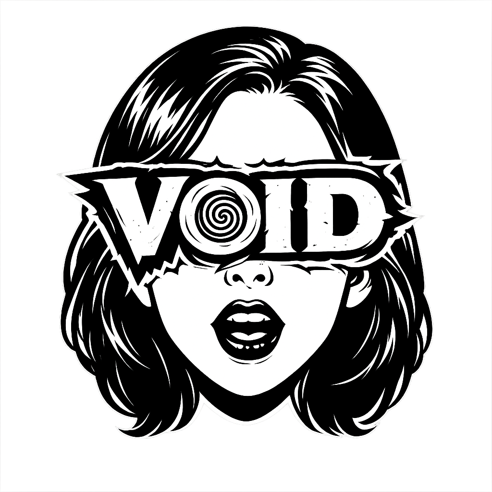

<p align="center">
  
</p>

<h1 align="center">VOID</h1>

<h3 align="center">A movie and TV show tracker hosted on GitHub Pages</h3>

<p align="center">
  <a href="https://tinykings.github.io/void/">tinykings.github.io/void</a>
</p>

---

<!-- Screenshot -->
<!--
<p align="center">
  
</p>
-->

## Overview

VOID is a personal media tracker built as a static Next.js app deployed to GitHub Pages. Track your watchlist and watch history for movies and TV shows, sync with your TMDB account, and launch content directly in external streaming players — all from the browser with no backend required.

Data lives entirely in your browser (IndexedDB) or within your TMDB profile.

## Features

### Core Tracking
- **Watchlist & History** — Add movies and shows to your watchlist or mark them as watched. Items are mutually exclusive between the two lists.
- **TV Show Auto-Migration** — Shows in your watch history automatically move back to the watchlist when a new episode airs within 7 days. Ended or canceled shows are excluded.
- **Ratings** — Rate watched content 1–5 stars, synced bidirectionally with TMDB.

### Discovery
- **Search** — Real-time search across all TMDB movies and TV shows.
- **Trending** — Browse weekly trending content from TMDB when opening search.
- **Media Details** — Full detail pages with cast, trailers, watch providers, season/episode info, content ratings, and next episode data.

### Sync & Backup
- **TMDB Account Sync** — OAuth login syncs your TMDB watchlist and rated items with local state. Rate-limited to 30-second cooldowns.
- **GitHub Gist Backup** — Optionally back up your watchlist and library to a Gist in a human-readable format for cross-device access.

### Streaming Integration
- **External Players** — Launch movies or episodes directly in external streaming sites via configurable URL templates. Supported players include Cineby, Bitcine, Fmovies, XPrime, and RiveStream.
- **TV Remote Play** — Send content from your phone to a TV receiver page polling a GitHub Gist queue, enabling a remote-play workflow across devices.
- **VidAngel** — Optional content filtering integration. Shows an "Edited" badge and filter toggle when enabled.

### App Experience
- **PWA** — Installable as a standalone app on mobile and desktop.
- **Offline Support** — Works offline with cached data via service worker.
- **Responsive** — Mobile-first grid layout (2–6 columns depending on screen size).
- **Animated** — Smooth view transitions via Framer Motion.

## Setup

### Requirements
- A free [TMDB API key](https://developer.themoviedb.org/reference/intro/getting-started)

### Quick Start
1. Open the app at [tinykings.github.io/void](https://tinykings.github.io/void/)
2. Go to **Settings** and enter your TMDB API key
3. Optionally log in with TMDB to enable account sync

### Optional: Cross-Device Sync (Gist)
1. Create a [GitHub personal access token](https://github.com/settings/tokens) (classic) with the `gist` scope
2. Create a new Gist at [gist.github.com](https://gist.github.com)
3. Enter the Gist ID and token under **Settings → TV / Sync**

### Optional: TV Remote Play
1. Enable **TV Support** in Settings
2. Copy the TV receiver URL and open it on your TV or second screen
3. Use the play button on any movie/episode to push content to the TV

## Tech Stack

| Layer | Technology |
|---|---|
| Framework | Next.js 16 (App Router, static export) |
| Language | TypeScript (strict) |
| Styling | Tailwind CSS 4 |
| Animations | Framer Motion |
| State | Zustand 5 |
| Persistence | IndexedDB via `idb-keyval` |
| Data | TMDB API v3 |
| Hosting | GitHub Pages |

## Architecture

```
src/
├── app/                  # Next.js App Router pages
│   ├── page.tsx          # Home page (watchlist/history/search)
│   ├── details/          # Media detail page
│   └── tv/               # TV receiver page
├── components/
│   ├── views/            # Page-level views (HomeView, SettingsView)
│   └── ...               # Shared UI components
├── store/
│   └── useStore.ts       # Zustand store — all app state, sync logic, TV migration
├── lib/
│   ├── tmdb.ts           # All TMDB API calls
│   ├── types.ts          # Core TypeScript interfaces
│   └── vidangel.ts       # VidAngel integration
└── context/
    └── AppContext.tsx     # React context wrapper around Zustand store
```

**Data flow:** Components → `useAppContext()` → Zustand store → persisted to IndexedDB (`void_user_state`). TMDB sync merges remote watchlist/rated items with local state.

## Development

```bash
npm install
npm run dev      # Start dev server at localhost:3000
npm run build    # Production static export to out/
npm run lint     # Run ESLint
```

## Deployment

GitHub Actions builds and deploys to GitHub Pages on every push to `main`. The static export is served from the `/void/` basePath.

## Settings Reference

| Setting | Description |
|---|---|
| TMDB API Key | Required for all media data |
| TMDB Login | OAuth sync with your TMDB account |
| External Player | Enable launch buttons with a choice of streaming site |
| VidAngel | Enable content filtering badges and filter |
| TV Support | Enable remote play to a second screen via Gist queue |
| Gist Backup | Auto-backup watchlist and library to a GitHub Gist |

## License

MIT
